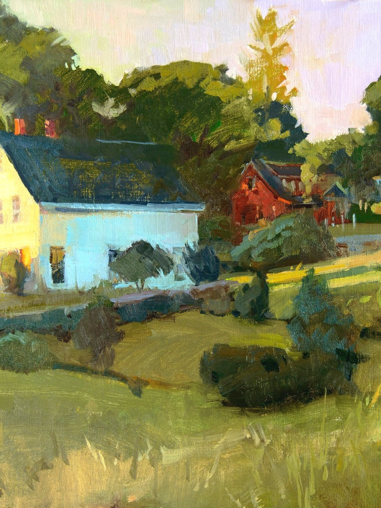

# ART (C)ART

## License

[This application is under the MIT license](https://opensource.org/licenses/MIT)

## Description

A full-stack application, which combines a robust back end—with servers, databases, advanced APIs, and user authentication—to an intuitive front end.

## Table of Contents

- [ART (C)ART](#art-cart)
  - [License](#license)
  - [Description](#description)
  - [Table of Contents](#table-of-contents)
  - [Credits](#credits)
    - [Collaborators:](#collaborators)
    - [Sources:](#sources)
    - [Images](#images)
  - [Deployment Link](#deployment-link)
    - [Deployment Click here!](#deployment-click-here)

<small><i><a href='http://ecotrust-canada.github.io/markdown-toc/'>Table of contents generated with markdown-toc</a></i></small>

## Credits

 

### Collaborators:

 

[Alex Lee](https://github.com/ayesslee)  
[Johnny Jin](https://github.com/fiamett)  
[Bradley Jester](https://github.com/jesterb0206)  
[Timothy Barnaby](https://github.com/tbarns)  
[Dorian Birch](https://github.com/206Dorian)

 

### Sources:

 

[How To Make Ecommerce Website Using HTML And CSS Step By Step | Create e-Commerce Website - Easy Tutorials](https://www.youtube.com/watch?v=yQimoqo0-7g)

[The Best Google Font Pairings for your Website](https://oregonlane.com/the-best-google-font-pairings-for-your-website/) We use the Italiana and Lato Regular font pairing in our website!

 

### Images

 
 

[7 Tips to Finding Inspiration for Art Link](https://www.pictureframesexpress.co.uk/blog/art-topics/7-tips-to-finding-inspiration-for-art/)

 
 

[A Sunday Afternoon on the Island of La Grande Jatte Link](https://en.wikipedia.org/wiki/A_Sunday_Afternoon_on_the_Island_of_La_Grande_Jatte)

 
 

[A Wall, Nassau Link](https://www.metmuseum.org/art/collection/search/11147)

 
 

[The 7th Arrondissement Link](https://palettehome.co/shop/the-7th-arrondissement/)

 
 

[August at South Beach Link](https://www.californiawatercolor.com/products/rex_brandt_august_at_south_beach)

 
 

[LAVRENKO, Boris Mikhaelovitch Link](https://www.invaluable.com/auction-lot/lavrenko-boris-mikhaelovitch-1920-rostow-am-don-2-3632-c-789412792c)

 
 

[Blue Day Link](https://patrickleefineart.com/)

 
 

[Eventide Sea and Waves Link](https://www.topalski.com/2016/original-fine-art-oil-paintings/eventide-sea-and-waves-oil-painting/)

 
 

[Cherry Blossoms Link](https://www.pinterest.com/pin/sarker-helal-uddin-cherry-blossoms-15x22inch-140lb-cold-pressed-arches-watercolor-paper-daniel-smith-w--285134220148266750/)

 
 

[Excitement Link](https://www.saatchiart.com/art/Painting-Excitement/774258/9145273/view)

 
 

[Front Gate Link](https://www.hawaiiwatercolorsociety.org/shop-the-2022-open-show/front-gate-1075x8-by-kayla-dubois)

 
 

[Grand View Link](https://galleryview.paletteandchisel.org/products/grand-view)

 
 

[Impression, Sunrise Link](https://www.onlandscape.co.uk/2017/12/the-impact-of-photography-on-impressionism/)

 
 

[Irish Farmland, North Coast Link](https://fineartconnoisseur.com/2018/11/10-spontaneous-fine-art-landscape-paintings/)

 
 

[On the Avenue Link](https://www.saatchiart.com/art/Painting-On-the-avenue/659089/1971627/view)

 
 

[Up From Tenants Harbor Link](https://loriputnam.com/1225-gallery/up-from-tenants-harbor)

 
 

[Winds of Change Link](https://www.quora.com/What-are-some-favorite-watercolor-paintings)

 
 

<h2 align="center">All other images courtesy of Easy Tutorials</h2>

 
 

<h3 align="center"> <a href="https://www.youtube.com/@EasyTutorialsVideo" target="_blank" rel="noopener">Easy Tutorials Link</a> </h3>

 
 

## Deployment Link

### [Deployment](https://art-cart-gui-guys-production.herokuapp.com/login) Click here!
